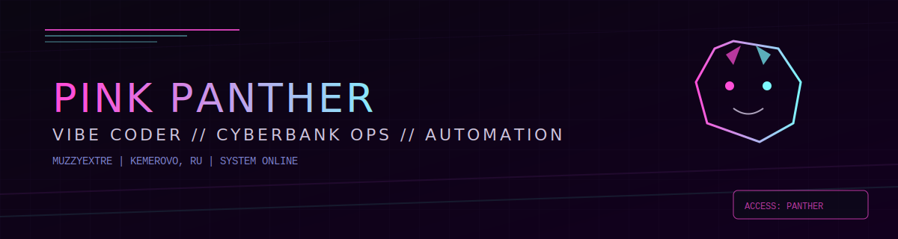

<p align="center">
  
</p>

<h1 align="center">MuzzyExtre // Pink Panther</h1>
<p align="center"><b>Vibe Coder</b> ? Cyberbank Ops ? Automation & Bots</p>

```
ACCESS: GRANTED
PROFILE: PINK PANTHER
MODE: CYBERBANK
```

<table>
  <tr>
    <td width="62%" valign="top">

## What I build
- Telegram bots that feel like products, not scripts
- AI-assisted automations for business workflows
- Server, VPN, OpenWrt setup and hardening
- Fast fixes for complex software problems

    </td>
    <td width="38%" align="center" valign="top">
      
      <br/>
      <sub>CYBERBANK SIGNATURE</sub>
    </td>
  </tr>
</table>

## Command deck
```
OPS: BOT / AUTOMATION / INFRA
STACK: PYTHON / LINUX / DOCKER
STATUS: ONLINE
```

## Selected ops
- [Telegram_BOT](https://github.com/MuzzyExtre/Telegram_BOT) ? Telegram automation base
- [call-agent-local](https://github.com/MuzzyExtre/call-agent-local) ? local agent runner
- [Smotrim-down-to-mp3](https://github.com/MuzzyExtre/Smotrim-down-to-mp3) ? media to audio flow
- [AI_prodavala](https://github.com/MuzzyExtre/AI_prodavala) ? AI sales helper stack

## Stack
- Python, Docker, Linux
- Telegram API, OpenWrt, VPN
- Automation, scraping, integrations

## Signals
- Profi: https://profi.ru/profile/SerikovSO
- YouDo: https://youdo.com/u12936447
- Avito: https://www.avito.ru/brands/9ebc055f0b1d378a1df67e539151a194

## DM
- Write on any platform above

<!--
Custom tips:
1) Replace contact links.
2) Swap repo list with your strongest public work.
3) Add 2-3 short case studies with results.
-->
